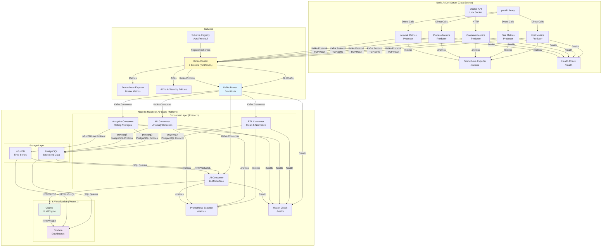
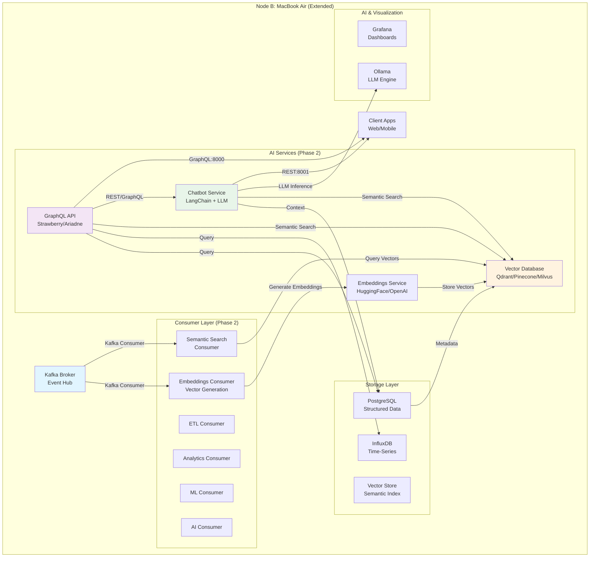
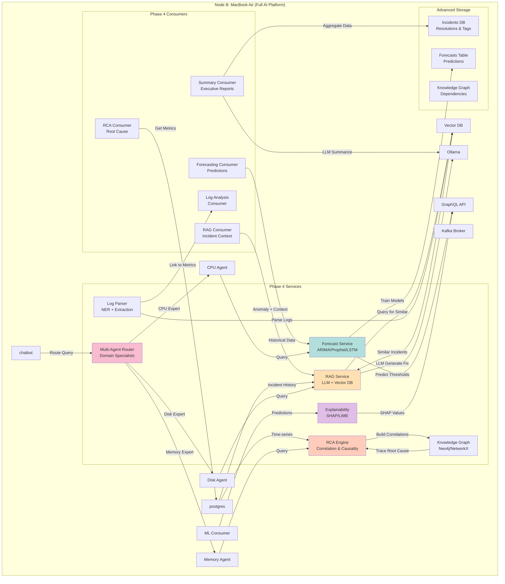

# System Architecture Diagram

## High-Level Architecture (Phase 1 & 2)



## Extended Architecture (Phase 2 & 3 - AI & Vector DB)



## Advanced Architecture (Phase 4 - Advanced AI)



## Architecture Principles

1. **Event-Driven**: All telemetry flows as events through Kafka
2. **Producer-Only on Node A**: Collects → Formats → Sends
3. **Consumer-Only Processing**: All processing happens on Node B (never on producers)
4. **Kafka as Backbone**: Single point of ingestion and decoupling
5. **Separation of Concerns**: 
   - Data collection (Node A)
   - Processing & storage (Node B)
   - Visualization & AI (Node B)

## Data Topics

### Phase 1 (Current)
| Topic | Producer | Purpose | Retention Policy |
|-------|----------|---------|------------------|
| `host.metrics` | Host Metrics | System uptime, process count, load | 7 days |
| `system.disk.metrics` | Disk Metrics | Disk usage and I/O stats | 30 days |
| `container.metrics` | Container Metrics | Docker container performance | 30 days |
| `process.metrics` | Process Metrics | Individual process stats | 30 days |
| `network.metrics` | Network Metrics | Network telemetry (planned) | 7 days |

### Phase 2 (AI & Vector DB) — Internal Topics
| Topic | Producer | Purpose | Retention Policy |
|-------|----------|---------|------------------|
| `metrics.normalized` | ETL Consumer | Cleaned, schema-validated events | 30 days |
| `metrics.analytics` | Analytics Consumer | Aggregated metrics, rolling stats | 30 days |
| `anomalies.detected` | ML Consumer | Anomalies with scores and context | 90 days |
| `embeddings.generated` | Embeddings Consumer | Metric summaries + vector embeddings | 90 days |

## Consumer Responsibilities

### Phase 1 (Current Focus)
- **ETL Consumer**: Data cleaning, schema normalization
- **Analytics Consumer**: Rolling averages, spike detection
- **ML Consumer**: Isolation Forest anomaly detection
- **AI Consumer**: LLM-based explanations and insights

### Phase 2 (AI & Vector DB)
- **Embeddings Consumer**: Converts metrics/logs into vector embeddings
  - Processes events from Kafka
  - Calls embeddings service
  - Stores vectors in vector database with metadata
- **Semantic Search Consumer**: Enables similarity-based queries
  - Indexes historical data for fast retrieval
  - Maintains vector store consistency
  - Supports anomaly correlation across time

## New AI Services (Phase 2+)

### Vector Database Layer
- **Purpose**: Store and query semantic embeddings of metrics and logs
- **Options**: 
  - Qdrant (self-hosted, high performance)
  - Pinecone (managed, easy setup)
  - Milvus (open-source, scalable)
- **Use Cases**:
  - Find similar past incidents
  - Semantic metric search ("Find spikes similar to yesterday's pattern")
  - Anomaly correlation ("What else changed when CPU spiked?")
- **Location**: Node B (`localhost:6333` for Qdrant, or managed service)

### Embeddings Service
- **Purpose**: Convert unstructured data into vector embeddings
- **Technology**:
  - OpenAI API (GPT embeddings) or HuggingFace (local models like `sentence-transformers`)
  - Converts metric summaries, logs, anomaly descriptions to 384-1536 dimensions
- **Location**: Node B, runs as a FastAPI service (`localhost:8002`)
- **Integration**: Embeddings Consumer calls this service for each event batch

### GraphQL API
- **Purpose**: Flexible querying interface for metrics, anomalies, and semantic searches
- **Framework**: Strawberry or Ariadne on FastAPI
- **Features**:
  - Query metrics with filters (host, time range, metric type)
  - Semantic search via vector similarity
  - Aggregated analytics (min/max/avg)
  - Real-time anomaly information
- **Location**: Node B (`localhost:8000`)
- **Example Query**:
  ```graphql
  query {
    metrics(host: "dell-node-a", timeRange: "24h") {
      id
      timestamp
      value
      anomalyScore
    }
    semanticSearch(query: "CPU spike", limit: 5) {
      similarity
      metric { timestamp, value }
    }
  }
  ```

### Chatbot Service (LangChain + LLM)
- **Purpose**: Natural language interface to the monitoring system
- **Technology**:
  - LangChain framework
  - Ollama (local LLM like Llama2, Mistral) or OpenAI
  - ReAct pattern: Reasoning + Tool use
- **Tools Available**:
  - Query PostgreSQL for metrics
  - Semantic search in vector DB
  - Call LLM for explanations
  - Fetch anomaly details
- **Location**: Node B (`localhost:8001`)
- **Example**:
  - User: "Why was container X slow yesterday?"
  - Chatbot: Queries metrics → Searches for similar incidents → Explains root cause

---

## Advanced AI Services (Phase 4+)

### Retrieval-Augmented Generation (RAG)
- **Purpose**: Ground LLM responses in real incident history and resolutions
- **Components**:
  - `rag_consumer.py`: Listens for anomalies, triggers RAG pipeline
  - `incident_store.py`: PostgreSQL table with past incidents, tags, resolutions
  - `incident_retriever.py`: Vector similarity search in Qdrant
  - `rag_service.py`: Combines context + LLM for actionable recommendations
- **Flow**:
  1. Anomaly detected (e.g., "Memory spike")
  2. Query vector DB for similar past incidents
  3. Retrieve top-3 similar incidents with their resolutions
  4. Pass context to LLM: "Given these 3 similar incidents with fixes, what's your recommendation?"
  5. Generate response with citations to historical fixes
- **Example Output**:
  ```
  "High memory detected (similar to Jun 1, May 15 events).
   Root cause: Java GC tuning. 
   Recommended action: Increase -Xmx to 4GB.
   Success rate in past: 95% (3/3 fixed)"
  ```
- **Location**: Node B (`localhost:8010`)

### Root Cause Analysis (RCA) Engine
- **Purpose**: Automatically trace anomalies to root causes via correlation analysis
- **Components**:
  - `correlation_analyzer.py`: Compute Pearson/Spearman correlations between metrics
  - `dependency_graph.py`: Build graph of metric dependencies
  - `rca_engine.py`: Trace anomaly backward through dependency graph
  - `granger_causality.py`: Test Granger causality for time-series
- **Algorithm**:
  1. Detect anomaly in metric X
  2. Find metrics with high correlation to X
  3. Check temporal causality (does Y predict X?)
  4. Build causal chain: Root → Intermediate → Observed Anomaly
  5. Rank potential root causes by confidence
- **Example**:
  ```
  Observed Anomaly: High CPU on container-api
  Correlation chain:
    ↑ CPU ← High query latency (r=0.92)
    ↑ Query latency ← High memory on DB (r=0.88)
    ↑ Memory on DB ← Insufficient GC (granger p<0.01)
  Root cause: Database GC not tuned for load
  ```

### Time-Series Forecasting
- **Purpose**: Predict metric values ahead; enable proactive alerting
- **Models Available**:
  - **ARIMA/SARIMA**: Statistical, handles seasonality
  - **Prophet**: Bayesian, handles holidays and changepoints
  - **LSTM**: Deep learning, captures complex patterns
  - **XGBoost**: Gradient boosting on engineered features
- **Components**:
  - `forecaster.py`: Base class with train/predict interface
  - `arima_forecaster.py`, `prophet_forecaster.py`, `lstm_forecaster.py`
  - `forecast_consumer.py`: Continuous retraining on new data
  - `model_selector.py`: Pick best model per metric
- **Features**:
  - Separate model per metric (CPU, memory, disk, etc.)
  - Daily retraining with walk-forward validation
  - Confidence intervals (e.g., "95% confident 45-55 MB in 1h")
  - Proactive alerts: "Disk will fill in 6 hours"
- **Location**: Node B (`localhost:8011`)

### Model Explainability (SHAP/LIME)
- **Purpose**: Understand ML anomaly detection decisions
- **Components**:
  - `explainer.py`: SHAP & LIME wrappers
  - `explanation_service.py`: Generate per-anomaly explanations
  - `feature_importance.py`: Aggregate importance across anomalies
- **Outputs**:
  - Force plots: How each metric pushed anomaly score up/down
  - Summary plots: Feature importance ranking
  - Dependence plots: How metric value affects anomaly score
- **Example**:
  ```
  Anomaly Score: 0.87 (Anomalous)
  
  Top Contributing Metrics:
  1. Memory 450MB (+0.35 contribution)
  2. Disk I/O 8500 ops/s (+0.28)
  3. CPU 12% (+0.24)
  4. Network RX 2.5MB/s (0.00 - normal)
  ```
- **Location**: Served via GraphQL API

### Multi-Agent Systems
- **Purpose**: Organize domain expertise; route user queries to specialists
- **Components**:
  - `router_agent.py`: LLM-based query router
  - `cpu_agent.py`: CPU anomaly specialist
  - `memory_agent.py`: Memory leak / OOM specialist
  - `disk_agent.py`: Disk space / I/O specialist
  - `container_agent.py`: Container-specific issues
  - `response_synthesizer.py`: Combine specialist outputs
- **Flow**:
  1. User query: "Why are containers restarting?"
  2. Router agent (LLM) classifies as "container/restart" issue
  3. Routes to `container_agent` + `memory_agent` (memory often causes restarts)
  4. Each agent investigates independently
  5. Synthesizer combines: "Containers restarting due to OOM (memory agent). 
     Recommend: Increase memory limits 2GB → 4GB"
- **Each Agent Can**:
  - Query specialized data stores
  - Use domain-specific tools (e.g., CPU agent uses `/proc/stat`)
  - Access historical patterns for that domain
  - Call forecasting models specific to their domain

### Natural Language Log Analysis
- **Purpose**: Correlate unstructured logs with metric anomalies
- **Components**:
  - `log_parser.py`: Extract structure from logs (grok patterns, regex, LLM)
  - `log_ner.py`: Named entity recognition (error codes, services, hosts)
  - `log_embedder.py`: Embed log lines into vector DB
  - `log_anomaly_correlator.py`: Link logs to metric anomalies
  - `log_analyzer_consumer.py`: Continuous log processing
- **Example**:
  ```
  Log line 14:25:33: "FATAL: OutOfMemoryError in thread-pool (container-api)"
  Anomaly 14:25:00: Memory spike from 200MB → 500MB
  
  System: Links log error to memory anomaly
  Output: "Memory spike caused by OutOfMemoryError in container-api.
           Previous similar events resolved by Java heap tuning."
  ```
- **Advanced**: Zero-shot classification to categorize error types without labeled data

### Automated Runbook Generation
- **Purpose**: Generate step-by-step troubleshooting guides automatically
- **Components**:
  - `runbook_template.py`: Templates for common issues
  - `runbook_generator.py`: LLM generates markdown runbooks
  - `runbook_store.py`: Store and version runbooks
  - `runbook_executor.py`: Optional CLI to execute steps
- **Example**:
  ```markdown
  # High CPU Anomaly Response (Jun 11, 14:30)
  
  ## Step 1: Get top CPU processes
  $ ps aux | sort -k3 -r | head -5
  Expected: Identify culprit
  
  ## Step 2: Trace offending process
  $ perf record -p <PID> -F 99 sleep 10
  $ perf report
  
  ## Step 3: Check history
  - Similar incident Jun 5 (Resolution: Restart container)
  - Similar incident May 15 (Resolution: Apply patch v2.3.1)
  
  ## Step 4: Recommended fix
  Restart container-api or apply patch
  ```

### Knowledge Graphs
- **Purpose**: Model and query relationships between services, metrics, and incidents
- **Technology**: Neo4j or NetworkX
- **Entities**:
  - Services, containers, processes
  - Metrics, thresholds, SLOs
  - Incidents, root causes, resolutions
  - Dependencies between all above
- **Queries**:
  - "What's the blast radius of this outage?"
  - "Which services depend on database-api?"
  - "Show all incidents affecting user-auth service"
- **Location**: Node B (`localhost:7687` for Neo4j or in-process with networkx)

### Few-Shot Learning
- **Purpose**: Teach system about new anomaly types with minimal examples
- **Components**:
  - `prompt_builder.py`: Build few-shot prompts dynamically
  - `example_library.py`: Store examples per anomaly type
  - `few_shot_classifier.py`: Classify using in-context learning
- **Example**:
  ```
  User provides 3 examples of "database deadlock" anomaly
  System: Uses those 3 in prompt to classify future incidents
  → "Describe 3 examples of 'database deadlock':
     1. High lock wait time + query timeout
     2. Multiple queries stuck on same table
     3. Sudden CPU spike + disk I/O increase
     
     Is this new event a 'database deadlock'? Why?"
  ```
- **No retraining needed**: Works via prompt engineering

### AutoML for Forecasting
- **Purpose**: Automatically select best model per metric
- **Components**:
  - `model_zoo.py`: All available models (ARIMA, Prophet, LSTM, XGBoost)
  - `automl_trainer.py`: Train all models on each metric
  - `model_evaluator.py`: Score on validation set (RMSE, MAE, MAPE)
  - `model_selector.py`: Pick best; monitor for degradation
  - `adaptive_forecaster.py`: Switch models if accuracy drops
- **Benefit**: No manual tuning per metric; system adapts to data distribution

### Anomaly Summarization
- **Purpose**: Generate executive summaries of system health (daily/weekly/monthly)
- **Components**:
  - `summarizer.py`: LLM generates narrative
  - `summary_aggregator.py`: Collect key events over time window
  - `summary_store.py`: Store summaries for audit trail
- **Example Output**:
  ```markdown
  ## Week Summary: Jun 2-8, 2026
  
  **Reliability**: 98.7% (↑0.3% vs previous week)
  **Anomalies**: 24 total (↓12% vs previous week)
  
  **Key Issues**:
  - Memory leaks in container-nginx (8 occurrences, now resolved)
  - Database query timeouts (3 occurrences, caused by missing index)
  
  **Recommended Actions**:
  1. Review nginx config changes (see runbook #42)
  2. Add database index on users.email
  3. Increase container-api memory allocation
  ```

## Communication Protocols

| Protocol | Usage | Port | Purpose |
|----------|-------|------|---------|
| **Kafka Protocol** | Producer → Broker<br/>Broker → Consumers | TCP:9092 | Event streaming, message serialization in JSON |
| **psycopg2** (PostgreSQL) | Consumers → PostgreSQL | TCP:5432 | Structured data writes (default) |
| **InfluxDB Line Protocol** | Consumers → InfluxDB | TCP:8086 | Time-series metrics writes |
| **HTTP/InfluxQL** | Grafana/AI → InfluxDB | TCP:8086 | Time-series data queries |
| **SQL** | Grafana/AI → PostgreSQL | TCP:5432 | Structured data queries |
| **HTTP/REST** | AI Consumer ↔ Ollama | TCP:11434 | LLM inference requests & responses |
| **Docker API** | Producers → Docker Daemon | Unix Socket | Container metrics collection |
| **Direct Library Calls** | Node A → psutil | N/A | System metrics collection (in-process) |
| **HTTP/REST** | Consumer → Vector DB API | TCP:6333 (Qdrant) | Store/query embeddings and metadata |
| **HTTP/REST** | Service → Embeddings Service | TCP:8002 | Convert metrics to embeddings |
| **GraphQL** | Client → GraphQL API | TCP:8000 | Flexible metric queries |
| **HTTP/REST** | Client → Chatbot API | TCP:8001 | Natural language questions |

## Network Topology

- **Node A (Dell Server)**: 192.168.x.x (Data Source)
- **Node B (MacBook Air)**: 192.168.2.110 (Core Platform)
  - Kafka Broker: `192.168.2.110:9092`
  - PostgreSQL: `localhost:5432` (on Node B)
  - InfluxDB: `localhost:8086` (on Node B)
  - Ollama: `localhost:11434` (on Node B)
  - Grafana: `localhost:3000` (on Node B)
  - **Vector DB (Qdrant)**: `localhost:6333` (on Node B) — *Phase 2*
  - **Embeddings Service**: `localhost:8002` (on Node B) — *Phase 2*
  - **GraphQL API**: `localhost:8000` (on Node B) — *Phase 2*
  - **Chatbot Service**: `localhost:8001` (on Node B) — *Phase 2*

## Data Format

All events follow this JSON structure:

```json
{
  "event_type": "host.metrics|container.metrics|system.disk.metrics|process.metrics|network.metrics",
  "timestamp": "2026-06-08T12:34:56.789Z",
  "host": "dell-node-a",
  "source": "psutil|docker",
  "metrics": {
    // Protocol-specific metrics
  },
  "tags": {
    "env": "lab",
    "node": "dell-node-a"
  }
}
```
