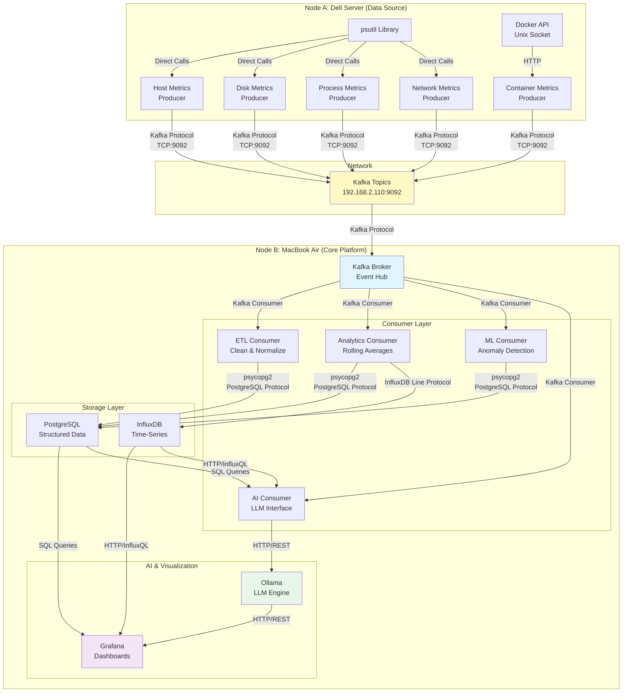

# System Architecture Diagram

## High-Level Architecture



## Architecture Principles

1. **Event-Driven**: All telemetry flows as events through Kafka
2. **Producer-Only on Node A**: Collects → Formats → Sends
3. **Consumer-Only Processing**: All processing happens on Node B (never on producers)
4. **Kafka as Backbone**: Single point of ingestion and decoupling
5. **Separation of Concerns**: 
   - Data collection (Node A)
   - Processing & storage (Node B)
   - Visualization & AI (Node B)

## Data Topics

| Topic | Producer | Purpose |
|-------|----------|---------|
| `host.metrics` | Host Metrics | System uptime, process count, load |
| `system.disk.metrics` | Disk Metrics | Disk usage and I/O stats |
| `container.metrics` | Container Metrics | Docker container performance |
| `process.metrics` | Process Metrics | Individual process stats |
| `network.metrics` | Network Metrics | Network telemetry (planned) |

## Consumer Responsibilities

- **ETL Consumer**: Data cleaning, schema normalization
- **Analytics Consumer**: Rolling averages, spike detection
- **ML Consumer**: Isolation Forest anomaly detection
- **AI Consumer**: LLM-based explanations and insights

## Communication Protocols

| Protocol | Usage | Port | Purpose |
|----------|-------|------|---------|
| **Kafka Protocol** | Producer → Broker<br/>Broker → Consumers | TCP:9092 | Event streaming, message serialization in JSON |
| **psycopg2** (PostgreSQL) | Consumers → PostgreSQL | TCP:5432 | Structured data writes (default) |
| **InfluxDB Line Protocol** | Consumers → InfluxDB | TCP:8086 | Time-series metrics writes |
| **HTTP/InfluxQL** | Grafana/AI → InfluxDB | TCP:8086 | Time-series data queries |
| **SQL** | Grafana/AI → PostgreSQL | TCP:5432 | Structured data queries |
| **HTTP/REST** | AI Consumer ↔ Ollama | TCP:11434 | LLM inference requests & responses |
| **Docker API** | Producers → Docker Daemon | Unix Socket | Container metrics collection |
| **Direct Library Calls** | Node A → psutil | N/A | System metrics collection (in-process) |

## Network Topology

- **Node A (Dell Server)**: 192.168.x.x (Data Source)
- **Node B (MacBook Air)**: 192.168.2.110 (Core Platform)
  - Kafka Broker: `192.168.2.110:9092`
  - PostgreSQL: `localhost:5432` (on Node B)
  - InfluxDB: `localhost:8086` (on Node B)
  - Ollama: `localhost:11434` (on Node B)
  - Grafana: `localhost:3000` (on Node B)

## Data Format

All events follow this JSON structure:

```json
{
  "event_type": "host.metrics|container.metrics|system.disk.metrics|process.metrics|network.metrics",
  "timestamp": "2026-06-08T12:34:56.789Z",
  "host": "dell-node-a",
  "source": "psutil|docker",
  "metrics": {
    // Protocol-specific metrics
  },
  "tags": {
    "env": "lab",
    "node": "dell-node-a"
  }
}
```
