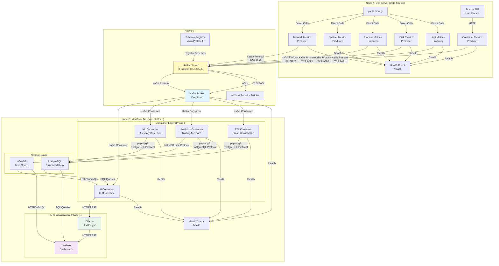
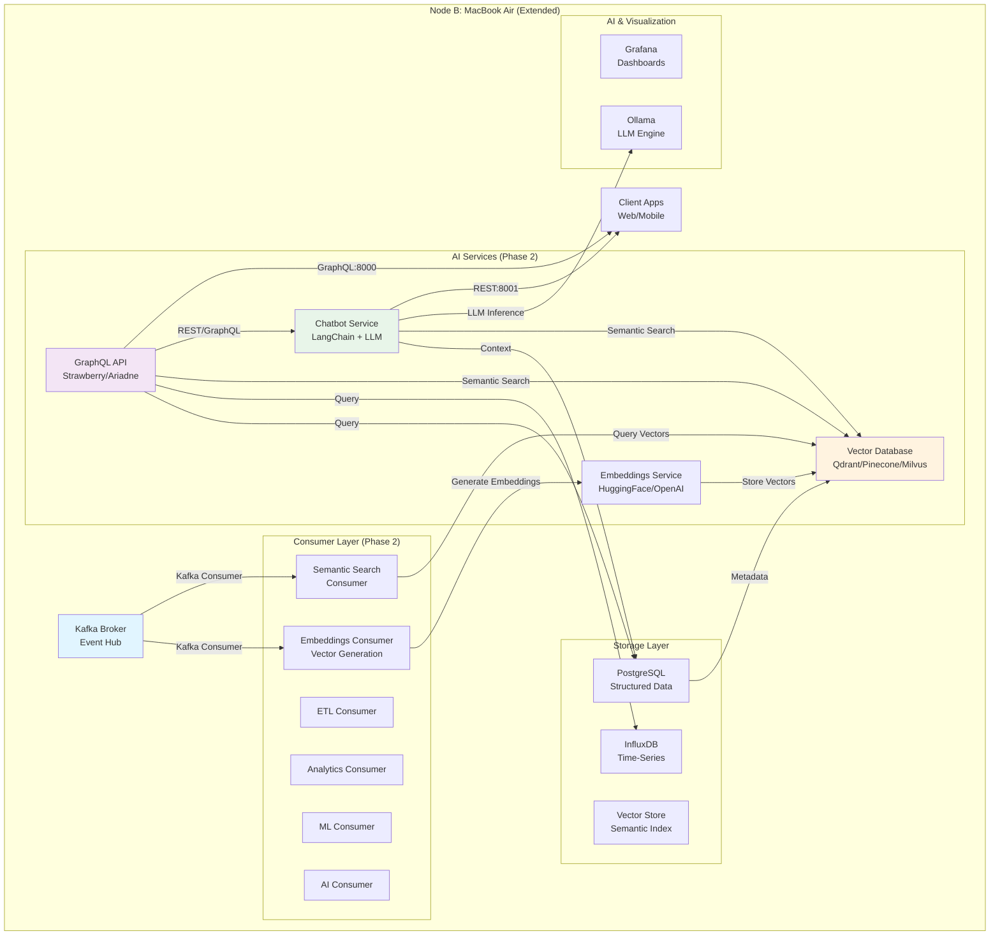
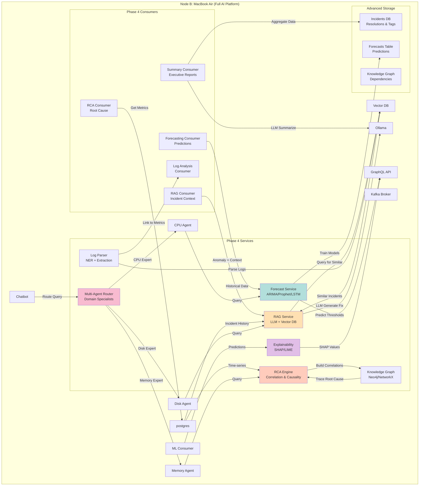

# System Architecture Diagram

## High-Level Architecture (Phase 1 & 2)

```mermaid
graph TB
  subgraph "Node A: Dell Server (Data Source)"
    psutil["psutil Library"]
    docker["Docker API<br/>Unix Socket"]
    host["Host Metrics<br/>Producer"]
    disk["Disk Metrics<br/>Producer"]
    container["Container Metrics<br/>Producer"]
    process["Process Metrics<br/>Producer"]
    network["Network Metrics<br/>Producer"]
    system["System Metrics<br/>Producer"]

    psutil -->|Direct Calls| host
    psutil -->|Direct Calls| disk
    psutil -->|Direct Calls| process
    psutil -->|Direct Calls| system
    docker -->|HTTP| container
    psutil -->|Direct Calls| network

    %% Health check endpoints
    healthA["Health Check<br/>/health"]
    host -->|/health| healthA
    disk -->|/health| healthA
    container -->|/health| healthA
    process -->|/health| healthA
    network -->|/health| healthA
    system -->|/health| healthA
  end

  subgraph "Network"
    cluster["Kafka Cluster<br/>3 Brokers (TLS/SASL)"]
    schemaRegistry["Schema Registry<br/>Avro/Protobuf"]
    acl["ACLs & Security Policies"]

    cluster -->|TLS/SASL| broker
    schemaRegistry -->|Register Schemas| cluster
    cluster -->|ACLs| acl
  end

  subgraph "Node B: MacBook Air (Core Platform)"
    broker["Kafka Broker<br/>Event Hub"]

    subgraph "Consumer Layer (Phase 1)"
      etl["ETL Consumer<br/>Clean & Normalize"]
      analytics["Analytics Consumer<br/>Rolling Averages"]
      ml["ML Consumer<br/>Anomaly Detection"]
      ai["AI Consumer<br/>LLM Interface"]
    end

    subgraph "Storage Layer"
      postgres["PostgreSQL<br/>Structured Data"]
      influx["InfluxDB<br/>Time-Series"]
    end

    subgraph "AI & Visualization (Phase 1)"
      grafana["Grafana<br/>Dashboards"]
      ollama["Ollama<br/>LLM Engine"]
    end

    %% Health checks for consumers and broker
    healthB["Health Check<br/>/health"]
    broker -->|/health| healthB
    etl -->|/health| healthB
    analytics -->|/health| healthB
    ml -->|/health| healthB
    ai -->|/health| healthB
  end

  host -->|Kafka Protocol<br/>TCP:9092| cluster
  disk -->|Kafka Protocol<br/>TCP:9092| cluster
  container -->|Kafka Protocol<br/>TCP:9092| cluster
  process -->|Kafka Protocol<br/>TCP:9092| cluster
  network -->|Kafka Protocol<br/>TCP:9092| cluster

  cluster -->|Kafka Protocol| broker

  broker -->|Kafka Consumer| etl
  broker -->|Kafka Consumer| analytics
  broker -->|Kafka Consumer| ml
  broker -->|Kafka Consumer| ai

  etl -->|psycopg2<br/>PostgreSQL Protocol| postgres
  analytics -->|psycopg2<br/>PostgreSQL Protocol| postgres
  analytics -->|InfluxDB Line Protocol| influx
  ml -->|psycopg2<br/>PostgreSQL Protocol| postgres

  postgres -->|SQL Queries| grafana
  influx -->|HTTP/InfluxQL| grafana
  postgres -->|SQL Queries| ai
  influx -->|HTTP/InfluxQL| ai
  ai -->|HTTP/REST| ollama
  ollama -->|HTTP/REST| grafana

  style broker fill:#e1f5ff
  style cluster fill:#fff9c4
  style grafana fill:#f3e5f5
  style ollama fill:#e8f5e9
```

## Extended Architecture (Phase 2 & 3 - AI & Vector DB)

```mermaid
graph TB
  subgraph "Node B: MacBook Air (Extended)"
    broker["Kafka Broker<br/>Event Hub"]

    subgraph "Consumer Layer (Phase 2)"
      etl["ETL Consumer"]
      analytics["Analytics Consumer"]
      ml["ML Consumer"]
      ai["AI Consumer"]
      embeddings["Embeddings Consumer<br/>Vector Generation"]
      semantic["Semantic Search<br/>Consumer"]
    end

    subgraph "AI Services (Phase 2)"
      embedder["Embeddings Service<br/>HuggingFace/OpenAI"]
      vectordb["Vector Database<br/>Qdrant/Pinecone/Milvus"]
      graphqlapi["GraphQL API<br/>Strawberry/Ariadne"]
      chatbot["Chatbot Service<br/>LangChain + LLM"]
    end

    subgraph "Storage Layer"
      postgres["PostgreSQL<br/>Structured Data"]
      influx["InfluxDB<br/>Time-Series"]
      vectorstore["Vector Store<br/>Semantic Index"]
    end

    subgraph "AI & Visualization"
      grafana["Grafana<br/>Dashboards"]
      ollama["Ollama<br/>LLM Engine"]
    end

    %% Phase 2 Connections
    embeddings -->|Generate Embeddings| embedder
    embedder -->|Store Vectors| vectordb
    semantic -->|Query Vectors| vectordb
    postgres -->|Metadata| vectordb
    
    %% GraphQL API connections
    graphqlapi -->|Query| postgres
    graphqlapi -->|Query| influx
    graphqlapi -->|Semantic Search| vectordb
    graphqlapi -->|REST/GraphQL| chatbot
    
    %% Chatbot connections
    chatbot -->|Context| postgres
    chatbot -->|Semantic Search| vectordb
    chatbot -->|LLM Inference| ollama
    
    %% Consumer to Services
    broker -->|Kafka Consumer| embeddings
    broker -->|Kafka Consumer| semantic
    
    %% Expose APIs
    graphqlapi -->|GraphQL:8000| Client["Client Apps<br/>Web/Mobile"]
    chatbot -->|REST:8001| Client
  end

  style broker fill:#e1f5ff
  style vectordb fill:#fff3e0
  style graphqlapi fill:#f3e5f5
  style chatbot fill:#e8f5e9
```

## Advanced Architecture (Phase 4 - Advanced AI)

```mermaid
graph TB
  subgraph "Node B: MacBook Air (Full AI Platform)"
    broker["Kafka Broker"]

    subgraph "Phase 4 Consumers"
      rag_c["RAG Consumer<br/>Incident Context"]
      rca_c["RCA Consumer<br/>Root Cause"]
      forecast_c["Forecasting Consumer<br/>Predictions"]
      logs_c["Log Analysis<br/>Consumer"]
      summary_c["Summary Consumer<br/>Executive Reports"]
    end

    subgraph "Phase 4 Services"
      rag_s["RAG Service<br/>LLM + Vector DB"]
      rca_s["RCA Engine<br/>Correlation & Causality"]
      forecast_s["Forecast Service<br/>ARIMA/Prophet/LSTM"]
      explainer_s["Explainability<br/>SHAP/LIME"]
      log_parser["Log Parser<br/>NER + Extraction"]
      kg_s["Knowledge Graph<br/>Neo4j/NetworkX"]
      multiagent_s["Multi-Agent Router<br/>Domain Specialists"]
    end

    subgraph "Advanced Storage"
      incidents_db["Incidents DB<br/>Resolutions & Tags"]
      forecasts_db["Forecasts Table<br/>Predictions"]
      kg_db["Knowledge Graph<br/>Dependencies"]
    end

    %% RAG flow
    rag_c -->|Anomaly + Context| rag_s
    rag_s -->|Query for Similar| vectordb["Vector DB"]
    vectordb -->|Similar Incidents| rag_s
    rag_s -->|LLM Generate Fix| ollama["Ollama"]
    postgres -->|Incident History| rag_s
    
    %% RCA flow
    rca_c -->|Get Metrics| postgres
    postgres -->|Time-series| rca_s
    rca_s -->|Build Correlations| kg_s
    kg_s -->|Trace Root Cause| rca_s
    
    %% Forecasting flow
    forecast_c -->|Historical Data| forecast_s
    forecast_s -->|Train Models| forecasts_db
    forecast_s -->|Predict Thresholds| graphqlapi["GraphQL API"]
    
    %% Explainability
    ml["ML Consumer"] -->|Predictions| explainer_s
    explainer_s -->|SHAP Values| graphqlapi
    
    %% Logs
    log_parser -->|Parse Logs| vectordb
    log_parser -->|Link to Metrics| logs_c
    
    %% Multi-agent
    chatbot["Chatbot"] -->|Route Query| multiagent_s
    multiagent_s -->|CPU Expert| cpu_agent["CPU Agent"]
    multiagent_s -->|Memory Expert| mem_agent["Memory Agent"]
    multiagent_s -->|Disk Expert| disk_agent["Disk Agent"]
    cpu_agent -->|Query| forecast_s
    mem_agent -->|Query| rca_s
    disk_agent -->|Query| rag_s
    
    %% Summary generation
    summary_c -->|Aggregate Data| incidents_db
    summary_c -->|LLM Summarize| ollama
    
    style rag_s fill:#ffe0b2
    style rca_s fill:#ffccbc
    style forecast_s fill:#b2dfdb
    style explainer_s fill:#e1bee7
    style multiagent_s fill:#f8bbd0
  end
```

## Gaps In The Current Architecture

- The event contract is documented here, but there is still no schema registry artifact or automated validation enforcing it.
- Kafka topology is ambiguous: the diagram shows both a single broker on Node B and a separate 3-broker cluster.
- Storage lifecycle is missing: there is no plan for schema migrations, retention, backups, or restore paths for PostgreSQL and InfluxDB.
- Observability is incomplete: `/metrics` and `/health` are shown, but alerting, consumer lag monitoring, and dead-letter handling are not.
- Security is only defined for Kafka; database, dashboard, and AI service authentication is not covered.
- The future-phase services are listed, but the migration path from the current producers to those services is not described.

## Node A Checklist

- [x] Host metrics producer collects uptime, load, process count, and CPU core data.
- [x] Disk metrics producer collects disk usage and I/O counters.
- [x] Container metrics producer collects container CPU, memory, network, and status data.
- [x] Process metrics producer collects top CPU and memory processes.
- [x] Network metrics producer collects interface traffic and error counters.
- [x] System metrics producer collects CPU, memory, and load data.
- [x] Shared event builder, retry logic, logging, and graceful shutdown are centralized in `common/producer.py`.
- [x] Container producer exposes a `/health` endpoint.
- [x] The architecture diagram explicitly shows `system.metrics` on Node A.
- [x] A formal event schema and versioning contract is documented for all producers.
- [x] Producer-level health and metric conventions are documented across Node A.
- [x] Prometheus exporter references have been removed from the architecture diagram.

## Event Contract

All Node A producers use the shared event builder in `common/producer.py` and emit the same envelope:

- Contract version: `1`.
- `event_type`: topic-aligned event name such as `host.metrics` or `system.metrics`.
- `timestamp`: UTC ISO-8601 timestamp ending in `Z`.
- `source`: collector source such as `psutil` or `docker`.
- `metrics`: producer-specific payload.
- `tags`: environment and node metadata, plus any producer-specific tags.
- `host`: optional host identifier when available.

Versioning rules:

- Backward-compatible additions may be made by adding optional fields to the envelope or nested metrics payload.
- Removing or renaming an existing top-level field requires a new contract version and coordinated consumer updates.
- Producers must keep `event_type` aligned with their Kafka topic name so routing remains deterministic.
- The shared builder in `common/producer.py` is the canonical source of the current envelope shape.

The envelope is intentionally stable so downstream consumers can normalize and route events without per-producer special cases.

## Node A Runtime Conventions

- Each producer owns one Kafka topic and one sampling interval.
- Producers emit environment and node tags consistently so downstream consumers can partition by deployment and host.
- Health checks are exposed only when the producer has meaningful runtime state to report; the container producer exposes `/health`, while the other current producers rely on loop progress and logging.
- Metric collection happens locally on Node A; all storage and downstream processing remain on Node B.
- The shared producer helper centralizes logging, retries, shutdown, and serialization behavior.